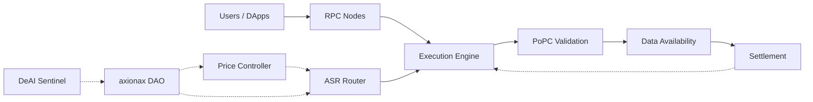

# axionax Protocol Core 🦀🐍

> **The Heart of axionax: High-Performance Blockchain Protocol
> Implementation**  
> Multi-language architecture combining Rust (core), Python (ML), and TypeScript
> (SDK)

[](LICENSE)
[](https://www.rust-lang.org/)
[](https://www.python.org/)
[](https://axionax.org)

---

## 🎯 About axionax Protocol

**axionax** is a Layer-1 blockchain that unifies **Execution**, **Validation
(PoPC)**, **Data Availability**, and **Settlement** with emphasis on
performance, transparency, and security for decentralized compute markets.

This repository contains the **core protocol implementation** - the foundation
of the entire axionax ecosystem.

### Part of axionax Ecosystem

This is the **core component** of the axionax Protocol. Complete ecosystem repositories:

- **Core Protocol**: [axionax-core](https://github.com/axionaxprotocol/axionax-core) - Blockchain implementation (this repo)
- **Web Interface**: [axionax-web](https://github.com/axionaxprotocol/axionax-web) - Official website & dashboard
- **TypeScript SDK**: [axionax-sdk-ts](https://github.com/axionaxprotocol/axionax-sdk-ts) - Developer SDK
- **Documentation**: [axionax-docs](https://github.com/axionaxprotocol/axionax-docs) - Protocol documentation
- **Marketplace**: [axionax-marketplace](https://github.com/axionaxprotocol/axionax-marketplace) - Compute marketplace dApp
- **DevTools**: [axionax-devtools](https://github.com/axionaxprotocol/axionax-devtools) - Development utilities
- **Deployment**: [axionax-deploy](https://github.com/axionaxprotocol/axionax-deploy) - Infrastructure scripts

---

## ⚠️ SECURITY WARNING

⚠️ **This is TESTNET code. Mainnet has NOT launched.**

**Official Networks:**

- **Testnet**: Chain ID `86137` (active for testing)
- **Mainnet**: Chain ID `86150` (reserved, not launched)
- **Local Dev**: Chain ID `31337` (local development only, not a public network)

**ANY network claiming to be "axionax Mainnet" is a SCAM.**

Verify at: https://axionax.org/networks

---

## � Latest Update (November 2025)

🎯 **Preparing for Public Testnet Launch!**

We've created a comprehensive **Multi-Repo Issue Manager** to track all pre-launch tasks:

✅ **15+ Issue Templates** covering:
- 🔒 Security Audits & Penetration Testing
- ✅ Unit Tests, Integration & E2E Testing (>80% coverage goal)
- 🏗️ Infrastructure, Monitoring & Load Testing
- ⛓️ Blockchain Setup & Smart Contract Deployment
- 📚 API, User & Developer Documentation
- 📢 Community Channels & Launch Planning

🚀 **Automated Workflow:** Issues distributed across 7 repositories automatically

📦 **Issue Manager Tool:** [`../issue-manager`](../issue-manager) - Track all pre-testnet tasks

---

## �🚦 Service Status

| Service              | Status              | Availability             |
| -------------------- | ------------------- | ------------------------ |
| ✅ Core Protocol     | **Operational**     | Available Now            |
| ✅ GitHub Repository | **Open Source**     | Available Now            |
| ✅ Documentation     | **Complete**        | Available Now            |
| ✅ Issue Tracker     | **Active**          | Available Now            |
| 🔥 Security Audit    | **In Progress**     | Pre-Launch               |
| 🔥 Testing Suite     | **In Progress**     | Pre-Launch               |
| 🔜 RPC Endpoint      | Coming Soon         | Q1 2026 (Testnet Launch) |
| 🔜 Block Explorer    | Coming Soon         | Q1 2026 (Testnet Launch) |
| 🔜 Token Faucet      | Coming Soon         | Q1 2026 (Testnet Launch) |
| 🔜 Discord Community | Coming Soon         | Q1 2026                  |
| 🔜 Twitter           | Coming Soon         | Q1 2026                  |

**Current Focus:** Security audits, performance testing, and documentation completion before public testnet launch.

**Want to contribute?** Check our [Issue Tracker](https://github.com/axionaxprotocol/axionax-core/issues) or see [DNS Setup Guide](./docs/DNS_SETUP.md) for deployment preparation.

---

## ✨ Key Features

### Core Protocol Innovation

- **🎲 Proof-of-Probabilistic-Checking (PoPC)**: Scalable validation through
  statistical sampling - O(s) verification cost instead of O(n)
- **🤖 Auto-Selection Router (ASR)**: ML-powered worker assignment with fairness
  guarantees and load balancing
- **💰 Posted Price Controller**: Dynamic pricing based on real-time utilization
  and queue length
- **🛡️ Advanced Security**:
  - Delayed VRF for unpredictable challenge selection
  - Stratified sampling for comprehensive coverage
  - Replica diversity to prevent collusion
  - Fraud-proof window with validator accountability
- **🤖 DeAI Sentinel**: ML-based anomaly detection and fraud prevention
- **🏛️ DAO Governance**: Community-driven parameter tuning and protocol upgrades

### Performance & Technical Specifications

#### Performance Metrics
- **⚡ High Throughput**: 45,000+ transactions/second
- **🚀 Fast Finality**: Sub-second transaction confirmation (~0.5s average)
- **📉 Low Overhead**: 3x faster than Go implementation, 2.67x less memory
- **💾 Efficient Storage**: RocksDB-backed state management with pruning
- **🌐 Scalable Network**: libp2p P2P networking with DHT routing
- **🔄 Block Time**: ~2 seconds target
- **📦 Block Size**: Dynamic (up to 5MB)

#### Technical Specifications
- **Consensus**: Proof-of-Probabilistic-Checking (PoPC)
  - Challenge sampling: O(s) complexity where s << n
  - Stratified sampling for coverage
  - VRF-based randomness with k-block delay
  - Byzantine fault tolerance: up to 33% malicious validators
- **Cryptography**: 
  - VRF (Verifiable Random Function) for unpredictability
  - BLS signatures for aggregation
  - SHA-256 for hashing
  - Ed25519 for node identities
- **Network Protocol**: libp2p with gossipsub v1.1
- **State Management**: 
  - Merkle Patricia Trie for state
  - RocksDB with column families
  - Snapshot support for fast sync
- **Smart Contracts**: 
  - WebAssembly (WASM) runtime
  - Gas metering and limits
  - Safe execution environment

### Architecture

**Multi-Language Design** for optimal performance:

```
┌─────────────────────────────────────────────┐
│         TypeScript SDK (10%)                │
│         - Client libraries                  │
│         - dApp integration                  │
└──────────────────┬──────────────────────────┘
                   │ JSON-RPC 2.0
┌──────────────────▼──────────────────────────┐
│         Rust Core (80%)                     │
│         - PoPC Consensus Engine             │
│         - Blockchain & State                │
│         - Cryptography (VRF, BLS)           │
│         - P2P Networking (libp2p)           │
│         - RPC Server                        │
└──────────────────┬──────────────────────────┘
                   │ PyO3 Bridge
┌──────────────────▼──────────────────────────┐
│         Python DeAI Layer (10%)             │
│         - Auto Selection Router (ASR)       │
│         - Fraud Detection (ML)              │
│         - Anomaly Detection                 │
│         - Price Controller                  │
└─────────────────────────────────────────────┘
```

## 🏗️ Architecture



📖 **[Full Architecture Documentation →](docs/ARCHITECTURE.md)**

**Performance**: 3x faster than Go, 2.67x less memory usage

## 🚀 Getting Started Guide

### 📋 Prerequisites

Before you begin, ensure you have:
- **Operating System**: Linux, macOS, or Windows with WSL2
- **Rust**: 1.75 or higher
- **Python**: 3.10 or higher
- **Node.js**: 18+ (for TypeScript SDK)
- **Git**: For cloning repositories
- **4GB+ RAM**: Recommended for development
- **10GB+ Disk**: For blockchain data

### ⚡ Quick Start (5 Minutes)

#### 1. Automated Installation

We provide automated dependency installers for all major platforms:

#### 🐧 Linux (Ubuntu/Debian/CentOS/RHEL/Arch/Alpine)

```bash
curl -sSL https://raw.githubusercontent.com/axionaxprotocol/axionax-core/main/scripts/install_dependencies_linux.sh | bash
```

#### 🪟 Windows (PowerShell as Administrator)

```powershell
irm https://raw.githubusercontent.com/axionaxprotocol/axionax-core/main/scripts/install_dependencies_windows.ps1 | iex
```

#### 🍎 macOS (10.15+)

```bash
curl -sSL https://raw.githubusercontent.com/axionaxprotocol/axionax-core/main/scripts/install_dependencies_macos.sh | bash
```

**These scripts install:**

- Rust 1.75+ & Cargo
- Python 3.10+
- Node.js 20 LTS
- Docker & Docker Compose
- PostgreSQL, Nginx, Redis
- Development tools (build-essential, pkg-config, openssl-dev)
- Optional: VS Code

**Manual Installation:** See [Prerequisites](#manual-prerequisites) below for
manual setup.

#### 2. Clone & Build

```bash
# Clone the repository
git clone https://github.com/axionaxprotocol/axionax-core.git
cd axionax-core

# Build the Rust core and Python bridge
cargo build --release

# Or use the unified test script (builds + tests + benchmarks)
./scripts/run_tests.sh
```

#### 3. Run Local Node

```bash
# Start a local development node
cargo run --release -- --chain-id 31337 --port 8545

# In another terminal, test the RPC endpoint
curl -X POST -H "Content-Type: application/json" \
  --data '{"jsonrpc":"2.0","method":"eth_blockNumber","params":[],"id":1}' \
  http://localhost:8545
```

#### 4. Explore Examples

```bash
# View TypeScript SDK examples
cd ../axionax-sdk-ts/examples

# Run basic example
npm install
npm run basic

# Or check Python integration
cd ../../axionax-core/tests
python integration_simple.py
```

### 📚 Next Steps

After installation:

1. **📖 Read Documentation**: Check [docs/](docs/) for detailed guides
2. **🧪 Run Tests**: `cargo test --all` for unit tests
3. **🎯 Try Examples**: Explore SDK examples in [axionax-sdk-ts](../axionax-sdk-ts)
4. **🤝 Contribute**: See [Contributing Guide](#-contributing) below
5. **💬 Join Community**: Discord, Twitter (Coming Q1 2026)

### 🆘 Troubleshooting

**Build fails?**
- Ensure Rust 1.75+: `rustc --version`
- Update Rust: `rustup update`
- Clean build: `cargo clean && cargo build`

**Python bridge errors?**
- Check Python 3.10+: `python --version`
- Install PyO3: `pip install maturin`
- Rebuild: `cd bridge/rust-python && maturin develop`

**Need help?** Open an issue: https://github.com/axionaxprotocol/axionax-core/issues

### Manual Prerequisites

If you prefer to install dependencies manually:

- **Rust 1.75+** & Cargo - [Install](https://rustup.rs/)
- **Python 3.10+** - [Download](https://www.python.org/downloads/)
- **Node.js 20 LTS** - [Download](https://nodejs.org/)
- **Docker** - [Install](https://docs.docker.com/get-docker/)
- **PostgreSQL 14+** - [Install](https://www.postgresql.org/download/)
- **Shell Environment** (Bash, Zsh, etc.)

### Performance Benchmarks

**Rust v1.6 vs Go v1.5:**

| Operation        | Go v1.5          | Rust v1.6        | Improvement    |
| ---------------- | ---------------- | ---------------- | -------------- |
| VRF operations   | 8,500 ops/sec    | 22,817 ops/sec   | **2.68x**      |
| Block validation | 1,200 blocks/sec | 3,500 blocks/sec | **2.92x**      |
| TX verification  | 15,000 tx/sec    | 45,000 tx/sec    | **3.0x**       |
| Memory (idle)    | 120 MB           | 45 MB            | **2.67x less** |

**Python Integration (PyO3 overhead):** < 10% for all operations

📖 **[Run benchmarks](tools/benchmark.py)** | 📖
**[Full results](docs/INTEGRATION_MIGRATION_GUIDE.md#3-performance-benchmarks)**

### Developer Quick Start

#### Using Python Bindings

```python
import axionax_python as axx

# VRF operations
vrf = axx.PyVRF()
proof, hash_output = vrf.prove(b"input_data")

# Consensus engine
engine = axx.PyConsensusEngine()
validator = axx.PyValidator("0xaddress", stake=1000000)
engine.register_validator(validator)

challenge = engine.generate_challenge("job_123", output_size=1000)
fraud_prob = axx.PyConsensusEngine.fraud_probability(0.1, 100)

# Blockchain queries
blockchain = axx.PyBlockchain()
block = blockchain.get_block(0)
height = blockchain.latest_block_number()
```

#### Using TypeScript SDK

```typescript
import { axionaxClient } from '@axionax/sdk';

const client = new axionaxClient('http://localhost:8545');

// Submit computation job
const jobId = await client.submitJob({
  code: jobCode,
  requirements: { compute: 100, bandwidth: 1000 },
});

// Query blockchain data
const price = await client.getComputePrice();
const status = await client.getJobStatus(jobId);
```

📖 **[Python API Docs](docs/PYTHON_API.md)** | 📖
**[TypeScript SDK Docs](../axionax-sdk-ts/README.md)**

## 🔗 axionax Protocol Ecosystem

This core implementation is part of the complete axionax Protocol ecosystem:

| Component            | Description                  | Location                                     | Status      |
| -------------------- | ---------------------------- | -------------------------------------------- | ----------- |
| **Core** (this repo) | Protocol implementation      | `axionax-core/`                              | ✅ Ready    |
| **Web**              | Official website & interface | [`../axionax-web`](../axionax-web)           | ✅ Ready    |
| **SDK**              | TypeScript developer SDK     | [`../axionax-sdk-ts`](../axionax-sdk-ts)     | ✅ Ready    |
| **Docs**             | Protocol documentation       | [`../axionax-docs`](../axionax-docs)         | 📝 Active   |
| **Marketplace**      | Compute marketplace dApp     | [`../axionax-marketplace`](../axionax-marketplace) | 🚧 Beta |
| **DevTools**         | Development utilities        | [`../axionax-devtools`](../axionax-devtools) | ✅ Ready    |
| **Deploy**           | Infrastructure & deployment  | [`../axionax-deploy`](../axionax-deploy)     | 🔥 Testing  |
| **Issue Manager**    | Task automation              | [`../issue-manager`](../issue-manager)       | 🎉 New!     |

**Organization**: [github.com/axionaxprotocol](https://github.com/axionaxprotocol)

---

## 📊 Tokenomics

- **Total Supply**: 1,000,000,000,000 AXX (1 Trillion, fixed cap)
- **Emission Rate**: ~2.25% APY from Ecosystem Reserve
- **Token Utilities**: Gas fees, Staking, Medium of Exchange, Governance

📖 **[Full Tokenomics Documentation →](docs/TOKENOMICS.md)**

## 🗺️ Roadmap

| Phase                 | Timeline  | Status         | Key Deliverables                     |
| --------------------- | --------- | -------------- | ------------------------------------ |
| **v1.6 Multi-Lang**   | Q4'25     | ✅ Complete    | Rust core, Python ML, TypeScript SDK |
| **v1.7 Network**      | Q1'26     | 🟡 In Progress | libp2p, RocksDB state, JSON-RPC      |
| **v1.8 Testnet**      | Q2'26     | 📅 Planned     | Full testnet deployment, integration |
| **v1.9 Mainnet Prep** | Q3'26     | 📅 Planned     | Security audit, performance tuning   |
| **v2.0 Mainnet**      | Q4'26     | 📅 Planned     | Public launch, production ready      |
| **Guardian Nodes**    | 2028-2029 | 🔬 Research    | Space-based validator nodes          |

📖 **[Full Roadmap →](docs/ROADMAP.md)**

## 📚 Documentation

### Core Documentation

- **[New Architecture (v1.6)](docs/NEW_ARCHITECTURE.md)** - Multi-language
  design
- **[Project Completion](docs/PROJECT_COMPLETION.md)** - v1.6 implementation
  summary
- **[Architecture Overview](docs/ARCHITECTURE.md)** - System design
- **[Project Status](docs/STATUS.md)** - Current status and next steps
- **[Getting Started](docs/GETTING_STARTED.md)** - Setup and installation
- **[Quick Start](docs/QUICKSTART.md)** - Quick start guide

### Key Guides

- **[Integration & Migration Guide](docs/INTEGRATION_MIGRATION_GUIDE.md)** -
  PyO3, testing, deployment
- **[Integration README](docs/INTEGRATION_README.md)** - Integration overview
- **[Contributing Guide](docs/CONTRIBUTING.md)** - How to contribute
- **[Python API Docs](docs/PYTHON_API.md)** - Python bindings reference
- **[TypeScript SDK Docs](../axionax-sdk-ts/README.md)** - TypeScript SDK reference
- **[Testing Guide](docs/TESTING_GUIDE.md)** - Testing strategies

### Protocol & Economics

- **[Security Model](docs/SECURITY.md)** - Threat model and mitigations
- **[Security Implementation](docs/SECURITY_IMPLEMENTATION.md)** - Security
  details
- **[Governance Guide](docs/GOVERNANCE.md)** - DAO participation
- **[Tokenomics](docs/TOKENOMICS.md)** - Token economics and distribution
- **[Roadmap](docs/ROADMAP.md)** - Development roadmap

## 🗺️ Roadmap & Milestones

### Phase 1: Core Development ✅ (Completed - Q4 2025)
- ✅ Rust blockchain core implementation
- ✅ PoPC consensus engine
- ✅ Python DeAI layer integration (PyO3)
- ✅ TypeScript SDK release
- ✅ Documentation & API references
- ✅ Local testnet environment

### Phase 2: Pre-Testnet Preparation 🔥 (Current - Q4 2025)
- 🔥 Security audits & penetration testing
- 🔥 Performance optimization & benchmarking
- 🔥 Test coverage >80% (unit, integration, E2E)
- 🔥 Infrastructure setup & monitoring
- 🔥 Load testing (50k+ TPS sustained)
- 🔥 Documentation completion

### Phase 3: Public Testnet Launch 🎯 (Target: Q1 2026)
- 🔜 Deploy RPC nodes (https://rpc.axionax.org)
- 🔜 Launch block explorer (https://explorer.axionax.org)
- 🔜 Token faucet service (https://faucet.axionax.org)
- 🔜 Community channels (Discord, Twitter, Telegram)
- 🔜 Developer documentation & tutorials
- 🔜 Bug bounty program
- 🔜 Testnet incentivized campaign

### Phase 4: Testnet Refinement (Q1-Q2 2026)
- Network stress testing
- Smart contract audits
- Validator onboarding
- Governance implementation
- Bridge development
- Ecosystem partnerships

### Phase 5: Mainnet Preparation (Q3 2026)
- Final security audits
- Token generation event (TGE)
- Mainnet genesis ceremony
- Validator setup & delegation
- Exchange listings preparation

### Phase 6: Mainnet Launch 🚀 (Target: Q4 2026)
- Mainnet activation (Chain ID: 86150)
- Initial validator set
- DAO governance activation
- Compute marketplace launch
- Ecosystem grants program

**Current Status**: Phase 2 (Pre-Testnet) - Security & Testing Focus  
**Next Milestone**: Public Testnet Launch Q1 2026

### Environment & Deployment

- **[Testnet v1.5](environments/testnet/axionax_v1.5_Testnet_in_a_Box/)** -
  Testnet v1.5 setup
- **[Testnet v1.6](environments/testnet/axionax_v1.6_Testnet_in_a_Box/)** -
  Testnet v1.6 setup
- **[Config Example](environments/config.example.yaml)** - Configuration
  template
- **[Docker Compose](environments/docker-compose.yaml)** - Docker setup

### Testing & Performance

- **[Unified Test Script](scripts/run_tests.sh)** - Builds and tests all
  components
- **[Integration Tests](tests/integration_simple.py)** - Python tests for Rust
  bindings
- **[Benchmark Suite](tools/benchmark.py)** - Performance benchmark script
- **[Quick Test Scripts](scripts/)** - Various testing utilities

## 🔐 Security

Key security mechanisms:

- **Delayed VRF** (k-block) for challenge selection
- **Stratified + Adaptive Sampling** for coverage
- **Replica Diversity** to prevent collusion
- **Fraud-Proof Window** with validator accountability
- **DA Pre-commit** with live audits

🐛 **Found a vulnerability?** Please report to security@axionax.org (PGP key
available)

## 🤝 Contributing

We welcome contributions from the community! Whether it's bug fixes, new features, documentation improvements, or testing - all contributions are valued.

### 🎯 Ways to Contribute

- **🐛 Report Bugs**: Open an issue with reproduction steps
- **💡 Propose Features**: Discuss new ideas in GitHub Discussions
- **📝 Improve Docs**: Fix typos, add examples, clarify guides
- **🧪 Write Tests**: Increase test coverage and quality
- **🔧 Fix Issues**: Check [good first issue](https://github.com/axionaxprotocol/axionax-core/labels/good%20first%20issue) label
- **🔐 Security**: Report vulnerabilities to security@axionax.org

### 📋 Development Workflow

1. **Fork & Clone**
   ```bash
   git clone https://github.com/YOUR_USERNAME/axionax-core.git
   cd axionax-core
   git remote add upstream https://github.com/axionaxprotocol/axionax-core.git
   ```

2. **Create Feature Branch**
   ```bash
   git checkout -b feature/your-feature-name
   # or
   git checkout -b fix/bug-description
   ```

3. **Make Changes**
   - Write clean, documented code
   - Follow Rust style guide (`cargo fmt`)
   - Add tests for new functionality
   - Update documentation as needed

4. **Test Your Changes**
   ```bash
   # Format code
   cargo fmt --all
   
   # Run linter
   cargo clippy --all-targets --all-features
   
   # Run tests
   cargo test --all
   
   # Run integration tests
   ./scripts/run_tests.sh
   ```

5. **Commit with Clear Message**
   ```bash
   git add .
   git commit -m "feat: add amazing new feature"
   # or
   git commit -m "fix: resolve memory leak in consensus"
   # or
   git commit -m "docs: improve getting started guide"
   ```
   
   **Commit Convention:**
   - `feat:` - New feature
   - `fix:` - Bug fix
   - `docs:` - Documentation changes
   - `test:` - Adding/updating tests
   - `refactor:` - Code refactoring
   - `perf:` - Performance improvements
   - `chore:` - Maintenance tasks

6. **Push & Create PR**
   ```bash
   git push origin feature/your-feature-name
   ```
   
   Then open a Pull Request on GitHub with:
   - Clear title describing the change
   - Description of what changed and why
   - Link to related issues
   - Screenshots/logs if applicable

### ✅ PR Review Process

1. **Automated Checks**: CI will run tests and linting
2. **Code Review**: Maintainers will review your code
3. **Feedback**: Address any requested changes
4. **Approval**: Once approved, PR will be merged
5. **Recognition**: Contributors are listed in releases!

### 📚 Additional Resources

- **[Full Contributing Guide](docs/CONTRIBUTING.md)** - Detailed guidelines
- **[Testing Guide](docs/TESTING_GUIDE.md)** - How to write effective tests
- **[Python API Docs](docs/PYTHON_API.md)** - Python bindings reference
- **[Code of Conduct](docs/CODE_OF_CONDUCT.md)** - Community standards

### 🏆 Recognition

All contributors are recognized in:
- Release notes
- GitHub contributors page
- Special acknowledgments for significant contributions

**Questions?** Join discussions or ask in issues!

## 📜 License

This project is licensed under the **GNU Affero General Public License v3.0
(AGPLv3)** with additional terms. See the [LICENSE](LICENSE) and
[LICENSE_NOTICE.md](docs/LICENSE_NOTICE.md) files for details.

## 🔗 Links

### axionax Protocol

- **GitHub Organization**: https://github.com/axionaxprotocol
- **Core Repository**: https://github.com/axionaxprotocol/axionax-core
- **Website**: https://axionax.org
- **Documentation**: https://docs.axionax.org (see [`../axionax-docs`](../axionax-docs))

### Network Endpoints

- **Testnet RPC**: https://rpc.axionax.org (Q1 2026)
- **Block Explorer**: https://explorer.axionax.org (Q1 2026)
- **Token Faucet**: https://faucet.axionax.org (Q1 2026)

### Development

- **GitHub Issues**: https://github.com/axionaxprotocol/axionax-core/issues
- **Contributing**: See [CONTRIBUTING.md](docs/CONTRIBUTING.md)

### Community (Coming Q1 2026)

- **Discord**: https://discord.gg/axionax
- **Twitter**: https://twitter.com/axionaxprotocol
- **Telegram**: https://t.me/axionax

---

## 🙏 Acknowledgments

Built with 💜 by the axionax Protocol community

**Core Technologies**:

- **Rust** - High-performance blockchain core
- **Python** - ML-powered DeAI layer (via PyO3)
- **libp2p** - P2P networking
- **RocksDB** - State storage
- **VRF/BLS** - Cryptographic primitives

**Inspired By**:

- Ethereum's execution layer
- Celestia's data availability
- Filecoin's proof mechanisms
- Akash Network's compute marketplace

---

**⚠️ Development Notice**: axionax Protocol v1.6 core is complete. Network layer
(v1.7) in progress. Testnet launch planned Q2 2026. Mainnet Q4 2026.

Made with 💜 by the axionax Protocol Team

**Last Updated**: November 7, 2025
